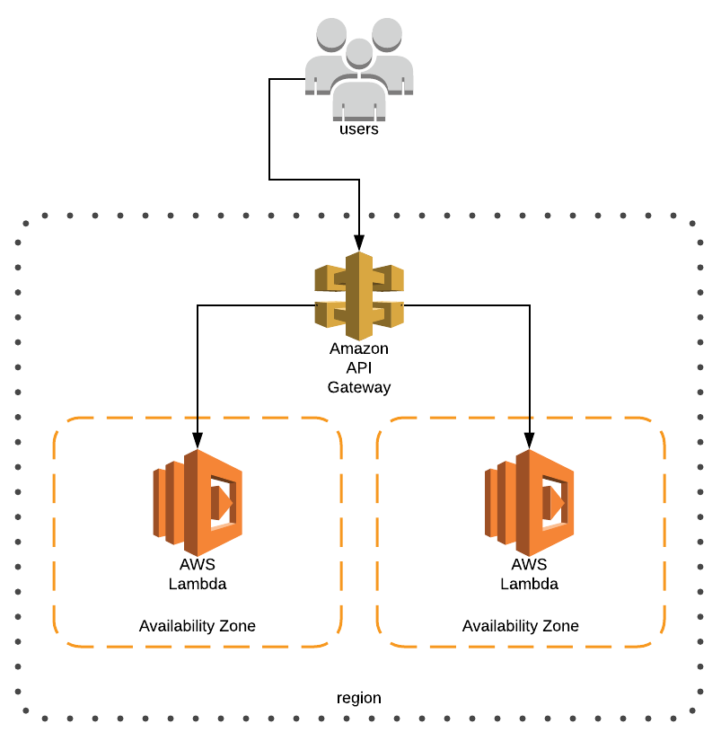

# Special Responder
##### A fancy little thingamajiger to launch a API Gateway / Lambda function in AWS.



## Introduction

This is a tool that can be used to build, test, and deploy a Lambda function
 behind an API Gateway in Amazon Web Services that returns a specific response.  In this case:
 
```json
{
  "message": "Automation for the People",
  "timestamp": "<current_epoch>"
}
```

## Getting Started

#### Requirements

This tool requires the following pre-requisites:

1. Linux, Mac, or Compatible bash-enabled OS
1. Docker
1. Docker-Compose
1. Git CLI
1. An AWS Account with the credential chain initialized.
    1. for more info, see this: https://docs.aws.amazon.com/cli/latest/userguide/cli-chap-getting-started.html
1. An S3 Bucket
    1. Doesn't have to already exist but the name specified must be unique.
    1. This tool will create the bucket for you if it doesn't already exist.

### The Easy Way

If you feel like skipping the below steps and doing it the easy way, feel free to run this:

```bash
# EXAMPLE: ./up.sh my_bucket v0.0.5
./up.sh <my_s3_bucket_name> <my_version>
```

To destroy and cleanup your environment, simply run:

```bash
./down.sh
```

### The Hard Way ( A.K.A = But I want to know how it works! )

#### Build fixtures

This tool uses docker-compose to make some of the standup orchestration simpler and easier.  
To get started, clone this repo and run a compose build, like this:

```bash
mkdir special-responder && cd special-responder
git clone https://github.com/stelligent/miniproject-LUCAS-MICHAEL.git .
docker-compose build
```

#### Run Tests

Like my grandma used to say: If you're not unit testing, it's broken.

In order to run a full suite of unit tests, you can run the following:

```bash
docker-compose run test
```

This uses python's built in "unittest" library to run a few basic tests, including:

* Testing the instantiation of the class.
* Testing the logic that allows the injection of a custom message.
* Asserting that the timestamp is epoch to the second without milliseconds.

#### Inital Setup

As stated in the pre-requisites, an S3 bucket is needed to store the codebase.  Let's copy 
the env.sh.template to env.sh and make some changes.  

```bash
cp env.sh.template env.sh
```

Put the name of the S3 bucket in "env.sh" at the line with the following:

```bash
export S3_BUCKET_NAME="<bucket_name>"
```

This will actually create the bucket if it doesn't exist, but its better to make sure that the 
bucket exists first.

Then you can optionally change the version number.

```bash
export TF_VAR_function_version="v0.0.10"
```

Once that is complete you can source the env to load your AWS credentials to the environment so 
terraform can access them through docker-compose's environment variables integration.

```bash
source env.sh
```

#### Upload your code

There is a nice little fixture to simplify uploading the lambda code to s3.

```bash
docker-compose run upload
```
You can optionally supply the version number for this deployment.  Just be sure to update the version number 
either in "env.sh" or by statically writing it into "deployment/main.tf".
```bash
docker-compose run upload v0.0.1
```

#### Deploy your stack to AWS

This tool uses terraform to provision the necessary AWS resources to run the stack.  This includes the 
following resources:

* API Gateway API, Resources, Stages, etc
* AWS Lambda Function
* IAM Roles and Polices for Execution and Invocation

First, change directory to ./deployment/ and edit the main.tf there as needed.  Follow the 
comments and directions in the file.  This main.tf is the root file that terraform will reference 
in the next step.

```bash
docker-compose run deploy
```

Terraform should return an output for each "module" stanza in "deployment/main.tf".  Each of these outputs, 
should the odds be ever in our favor, will be a functional endpoint returning the desired output.

#### OPTIONALLY: Run any terraform command

You can also optionally run ANY terraform command with docker-compose like so:

```bash
docker-compose run terraform destroy
```

### In Conclusion

I hope you had fun reviewing my fun little thingamajiger.  Feel free to drop any questions or improvements as 
issues to the repo!